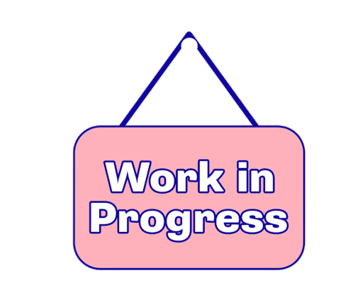

# Teclado mecânico no Hotbit - MSX

Aqui mostro detalhes da adaptação de teclado de membrama para teclado com switches de teclado mecânico, feita para o microcomputador Hotbit HB-8000 (padrão MSX).

## Apresentação

ineficácia do teclado original (membrana). moda e desejo de muitos de um teclado mecânico pro Hotbit. compatibilidade quase ideal das teclas originais com switches (dust proof)

 
Comparando o Hotbit com um teclado mecânico, doador das switches para esse projeto.

Membrana e PCB originais do Hotbit.

## Estudos

medidas e desenho feito em CAD como esboço pra possível corte em CNC, foi concluído um alto custo da confecção da base do teclado por esse método. além da confecção de PCB personalizada

 Encaixe de tecla que não usa estabilizador

 
Conjunto tecla (sem estabilizador) e switch

 Switch Outemu Blue dust-proof

 Medindo a base original do teclado com paquímetro e no "olhômetro".

 Carcaça do Hotbit junto com esboço feito com posição aproximada do centro de cada tecla

## Solução mais barata

idealização de um gabarito impresso em 3D que encaixa nos furos das teclas da base original do teclado do Hotbit, para execução de furos quadrados de 14mm x 14mm de maneira artesanal

 Gabarito para traçar o furo quadrado em cada tecla, feito em papel (não foi utilizado)

 Gabaritos para os furos e adaptadores para uso nas teclas com estabilizadores.

 Gabaritos encaixados em furos de tecla (somente o menor, da esquerda, foi utilizado)

## Procedimento

usar o gabarito traçando os limites do furo, utilizar "faca quente" pra corte grosseiro e lima para refinar o corte. uso de adaptador impresso em 3D nas teclas que usam estabilizadores e substituição parcial dos estabilizadores de plástico por de metal, com 2mm a mais de comprimento pra não interferir no movimento das switches. circuito "handwire" feito por questão de economia.

 Ferro de solda adaptado em "Faca quente" com uso de uma lâmina de formão para artesanato.

 Começando o primeiro furo.

 Primeiro furo feito.

 Encaixando o gabarito no furo.

 
 Traçando onde cortar ao redor do gabarito.

 Corte grosseiro feito com a "faca quente"

 Usando (literalmente nas coxas) uma lima para tirar rebarbas e refinar o corte.

 Furo finalizado.

 Só falta metade...

 

Detalhe de ajuste feito nas tecla com estabilizador.

 Falta o último furo.

 Dica Rápida: tirando pedaço de estabilizador quebraço com auxílio de uma broca de 0,8mm e uma "chavinha de relojoeiro"

 Começando o circuito "handwired"... pra que gastar mandando fazer uma PCB num projeto artesanal??? :)

 Falta metade... isso foi mais agradável de fazer do que cortar plástico.

 Matrix pronta. Falta prender o conector à base plastica, colocar também o conector da chave do slot e os leds.

 PRONTO!!! quer dizer... falta os esbilizadores das barra de espaço, return e cursor direto / esquerdo.

 Detalhe da barra estabilizadora da barra de espaço.

## Soluções para alguns defeitos

lixar partes das teclas que não precisam que adaptação no encaixe com switches. para evitar "prender" teclas

## Como tornar o processo mais "profissional"

projeto de base nova em metal com furos cortados de maneira automatizada, e da PCB nova com soquetes "hotswap" para as switches

